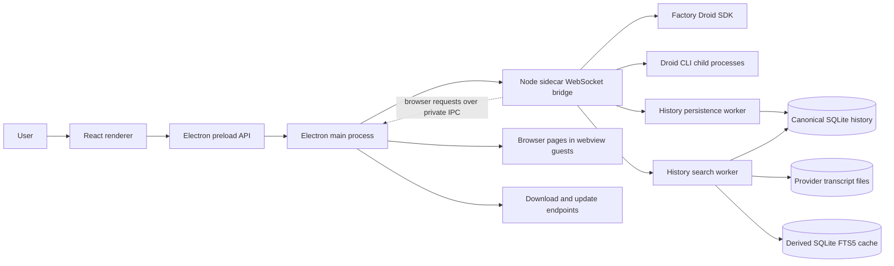

# Architecture

DROIDEX is split into three runtime surfaces: the React renderer, the Electron host, and the Node sidecar. Dedicated Node worker threads isolate high-frequency history persistence, provider-file reconciliation, transcript parsing, and full-text indexing from agent orchestration.

## Runtime flow

## Components

| Area | Path | Responsibility |
| --- | --- | --- |
| Renderer | `src/` | React UI, local state, settings, onboarding, session and Mission Control views |
| Electron main | `electron/main.cjs` | Window lifecycle, bridge process management, browser pages and the agent's browser requests (`electron/nativeBrowser*.cjs`), downloads, update checks |
| Electron preload | `electron/preload.cjs` | Narrow API boundary between renderer and Electron main process |
| Native browser preload | `electron/nativeBrowserPreload.cjs` | Browser automation bridge for embedded native browser flows |
| Sidecar | `sidecar/src/` | Local WebSocket bridge, Droid SDK session lifecycle, Mission Control integration, CLI discovery |
| History worker threads | `sidecar/src/historyPersistenceWorker.ts` | Independently supervised writer and index workers for batched durability, file reconciliation, transcript extraction, and SQLite FTS away from the sidecar event loop |

## Data and control boundaries

- The renderer does not call the Droid SDK directly. It communicates through preload APIs and the sidecar bridge.
- The Electron main process owns local process lifecycle and injects bridge configuration into the sidecar.
- Main owns every browser page. The renderer mounts each chat's page as a `<webview>` only with a one-time token main issues, and main binds, hardens and navigates it. The sidecar's browser tools reach main directly over a private IPC channel opened when main spawns it (`sidecar/src/browser/desktopBrowserChannel.ts`, `electron/nativeBrowserRequests.cjs`): each request carries its own id and is answered on the same sidecar run, nothing is replayed after a restart, and while main works on a page it tells the renderer's Browser host to keep that page mounted and awake, pane open or not. A page is laid out at its session's viewport: Fit follows the pane, and a standard size (desktop, laptop, tablet, mobile) keeps its own CSS size in the pane, drawn scaled down with a CSS transform, so the user sees what the agent reads. Agents read pages from Chromium's accessibility tree, cross-site frames included through their own debugger sessions (`electron/browserReading.cjs`, `electron/browserFrames.cjs`), and screenshots have sensitive fields painted over in main before the image leaves (`electron/browserScreenshot.cjs`, `electron/browserMasking.cjs`). Agent actions are trusted CDP input sent from main (`electron/browserActions.cjs`, `electron/browserKeys.cjs`), keys to the frame that holds the focus. Actions that move a page on, and waits, run one at a time per page, in the order they came, while reads run alongside; `browser_wait` is checked in main as the page changes (`electron/browserWait.cjs`). The page script is called only in the preload's isolated world (`electron/browserPageScript.cjs`), never through the page's own world.
- The sidecar owns Droid SDK calls and child process environment shaping. It removes `FACTORY_API_KEY` unless a key is explicitly configured.
- Live canonical session state stays in the sidecar. A bounded write-behind queue sends lossless event rows and latest-wins summary/child snapshots to the history worker in ordered transactions.
- Packaged builds require a bridge token. Development builds may allow local no-token access with `BRIDGE_ALLOW_LOCAL_NO_TOKEN=1`.

### Sidecar session core

- `appSessionId` is the stable top-level application identity. `childSessionId` is the stable logical child identity within its `parentAppSessionId`; `providerSessionId` is reserved for the backing Factory session.
- `SessionManager` is the composition root and public command coordinator. It retains public dispatch, cross-module routing, and shutdown ordering.
- `FactoryRuntime` is the narrow SDK seam; `DroidRuntime` is its production adapter. A Droid steer is `add_user_message` with a caller-minted `messageId`, delivered when the user message carrying that id arrives and dropped on discard, acknowledged Stop or close. Slash-command candidates use ordinary delivery. `DroidTurn` keeps the app turn open across Droid's follow-on loops and an in-flight interrupt, observing an active loop through its terminal idle before emitting one final result. The SDK owns main-loop conversion; only late-loop notifications are buffered and converted here. Child sessions still queue.
- `SessionRegistry` owns top-level sessions only: the live parent map, stable application identity, provider aliases, canonical parent summary persistence, and projected summary reads. Children never enter `SessionRegistry` or `sessions.list`.
- Ordinary chats enter durable `sessions.list` history only after the provider file contains both a user message and an assistant response. In-progress first turns remain visible through the live registry; abandoned or unanswered provider files never become permanent sidebar rows. Once admitted, an app-owned primary chat retains its cached summary and DROIDEX title if its transcript becomes unavailable or returns with only a header, including across restarts; file reconciliation never deletes app-owned notices. Missing files are excluded from indexing until they return. Delete/archive tombstones live only in renderer storage, so they survive metadata caps and catalog omissions to keep retained chats hidden.
- If full-text search initialization fails while cached summaries remain readable, catalog listing and loading remain available and search is disabled. History health carries the cause and repair instructions to a banner and toast, including on connect and snapshot recovery. The shared search database is preserved for repair because missing transcripts cannot reconstruct retained summaries.
- `ChildSessions` is the one stateful generic owner of parent-child membership, canonical child identity, provider replacement, admission, capacity, queues, turns, settings, cleanup, exact context/compaction targets, and child persistence/hydration. Spawn ownership is indexed during hydration, admission, and link changes so child deltas do not scan historical siblings.
- `MissionControlPolicy` owns only AGI Mission Control policy and projection: features, progress, worker/validator decisions, spawn correlation, Mission phase, and Mission completion. It may call `ChildSessions`; `ChildSessions` does not import Mission Control.
- `SessionTimeline` owns history listing and restore, child replay, status entries, and the canonical record-before-emit path for live transcript events. Routed non-Droid child output uses the same provider transcript writer in a separate `provider-sessions/<childSessionId>.jsonl` file. Each coalesced child run is persisted immediately because it has no independent turn-settlement callback. The child header records its parent, keeping it out of top-level history; child replay resolves the stable child identity to that file. Stored tool calls and results retain `pollsChildSessionId` and `interrupted`, preserving hidden child polling and interrupted labels on replay.
- `SessionVoice` forwards live speech to the voice surface and sends finished utterances through `SessionTimeline` as spoken chat rows. Provider transcript files retain the speaker, spoken mark, and corrected text under one stable row id for reload and paging.
- Completed child waves retain their result previews until the parent accepts them. Pending and running siblings block delivery; manual and automatic compaction retry it on settlement. Stop and Send now never accept a wake. Accepted wakes use the ordinary background-turn error owner.
- `SessionContext` owns context snapshots, polling, compaction generations, and usage carryover. Parent and child targets remain isolated by `appSessionId` or the exact `parentAppSessionId + childSessionId` pair.
- Task children keep the custom-agent label and the effective model/reasoning from that exact provider-session launch as separate metadata. The renderer never derives a child model from its label or parent session; stable child IDs remain available in row diagnostics when labels repeat.
- `SessionCompaction` owns compaction-limit policy, provider arming, automatic notification transitions and watchdogs, and live or historical manual compaction. Child automatic settlements validate the captured parent, runtime, turn, and configuration generations before publishing or mutating state.
- `SessionInteractions` owns permission and question correlation, equivalent-signature grants, and the Spec-to-Auto transition. After successful Registry unregister, Lifecycle calls `forgetSession()`, which discards module-owned state without resolving callbacks or emitting events. PR 4 introduces no deterministic shutdown settlement; that behavior remains deferred.
- Approval and question requests carry stable `requestId`s. The renderer keeps each session's pending requests in arrival order and settles only the matching id; consumers display the first pending request. Questions retain headers, option descriptions, and multiple selections as `{ selected: string[], custom?: string }` answers. Claude serializes selections into its question-text keyed answer map; Codex keeps arrays; Droid receives its scalar answer at its adapter boundary.
- Approval `detail` carries concrete tool input separately from the provider's explanatory `title`; file changes may carry `diff`. `canAlwaysAllow` requires a grant signature and provider permission, and `SessionInteractions` enforces it on both grant reuse and settlement. `refuse` declines an action without interrupting Claude or Codex; `cancel` stops the turn. Droid's SDK exposes only `Cancel` for refusal.
- `SessionEventFlow` owns stream and notification normalization, per-app/per-source terminal gating, and transcript-before-side-effect ordering. It has one callback into Manager for the coupled policy that remains there.
- `SessionLifecycle` owns primary-session create, resume, lazy resume, send queueing, pending steers, Send now, interruption, and ordered cleanup. Parent close calls one semantic `ChildSessions.closeParent()` operation rather than maintaining another child map.
- Provider `steer(text, mentions, steerId)` resolves `true` for confirmed consumption, `false` for definitive refusal and report recovery or user-prompt requeue, `withdrawn` for confirmed take-back, or `unconfirmed` when consumption or cancellation cannot be established. Unconfirmed handoffs never replay.
- `session.withdrawSteer` carries `appSessionId`, `steerId`, and a `requestId`; `session.steerWithdrawn` echoes those identities with `withdrawn` and, on success, the full prompt text and mentions. True means the model cannot see the prompt: app-owned queued prompts are removed immediately; Claude harness-held steers require `cancelAsyncMessage` confirmation or a matching cancelled lifecycle frame. That confirmation survives provider shutdown. Codex and Droid harness-held steers return false. Lifecycle retains the latest 64 withdrawn or delivered outcomes per live session so repeated requests replay the receipt. The renderer keeps a lost withdrawal marked and retries once per bridge reconnect; it never infers withdrawal from the pending list. Pending summary rows publish `canWithdraw`; only listed steers offer Send now or take-back. Send now retains harness ownership until settlement even while the prompt also waits in `pendingSends`. Confirmed withdrawal settles the original steer without delivery or fallback requeue.
- Workspace sessions pass their selected folder to Factory unchanged. Folder-less sessions remain `workspaceKind: none` in navigation, while their Factory runtime uses the app-owned `chats/` directory under `DROIDEX_USER_DATA_DIR`; DROIDEX creates it before opening the session, resumes the session from it (Claude Code files sessions under the directory they ran from), and never uses the user's home directory as an implicit workspace.

### Chat preferences

`fastMode` and `contextWindowTokens` are per-chat preferences, independent of
reasoning effort. Both live on `app_sessions` as nullable columns (`fast_mode`,
`context_window_tokens`) written in the same statement as the rest of the
summary; history schema v5 adds them, and NULL means the chat never chose. The
summary, provider transcript head and adjacent settings preserve an explicit
`false` and an explicit window across resume and history reconstruction.

`fastMode` starts explicitly off on Claude Code and Codex chats; omitted settings
updates leave it unchanged. Droid does not support it. Model catalogs publish
`supportsFastMode` when known.

Claude Code receives `settings.fastMode` at launch and `applyFlagSettings` live.
A contradictory result adds one quiet unavailability status row per runtime.
Codex receives `serviceTier: priority | default` on thread start, resume and every
turn start; changes affect the next turn. This records requested routing, not a
promise of delivered speed. Codex 0.157.1 accepts and echoes both tier values.

### Local Projects

`projects/ProjectService` owns the project graph over ordinary sessions:
membership, plans and holds. `ProjectTurns` reads each settled thread turn and
writes one bounded report to the chat that started it. `ProjectWakeQueue` owns
wake admission and a two-turn concurrency limit; it reuses the scheduled-delivery
receipt rather than inventing another runtime queue. The session bridge binds
membership durably before the first goal can execute. `SessionLifecycle`
remains the sole runtime owner.

Thinking and tool output are never forwarded in a report. Busy recipients wait
for session availability or capacity events. A steered report settles at the
provider call and never replays; unread replies survive lost pushes. Scheduled
turns retain their provider acceptance receipt. On restart, sending claims made
entirely of reports are dropped with their replies unread; other claims require
review.
Permission requests stay with the human. A thread's own question goes to the
chat that started it, and the human can still answer it in the thread.

The renderer keeps the projects snapshot once in its app store and opens
conversations through the normal chat and composer. A chat's own tools for
starting and steering other chats arrive the way the browser's and automations'
do: the `droidex-sessions` in-app MCP server for Droid and Claude Code, or
deferred dynamic tools using the same handlers for Codex. Codex does not start
local MCP listeners, and unattended automation runs receive neither set. The
sidebar tools never keep a copy of the sidebar: each call sends the window a
`sidebar.request` and waits up
to three seconds for its `sidebar.result`, which the app root answers from one
read of the store, so it works with the sidebar collapsed. See
[Session tools](session-tools.md) for the twelve tools, and
[Projects](projects.md) for current capabilities and limitations.

### Child runtime residency

- Every live child runtime is a provider operating-system process. One measures roughly 350 MiB resident while doing nothing, so the four concurrently live child runtimes the budget allows are the largest single memory cost in the application.
- `childRuntimeBudget` decides admission and which idle runtime is evicted under pressure. `childRuntimeRetirement` decides when a runtime may be released with no pressure at all, and `ChildSessions` owns both timers and the close itself.
- A runtime is released after `CHILD_RUNTIME_IDLE_RETIREMENT_MS` (5 minutes) without use, and only once the child is fully settled: the parent no longer reports it running, no turn is streaming, nothing is queued or compacting, no interrupt is in flight, no mutation is pending, no open attempt is outstanding, and the last result has reached history. A child doing work is never retired, however long its runtime has sat unused.
- Retirement closes the provider process only and writes nothing to the child's transcript. The child, its persisted transcript, and its history survive. Opening it again paints history first and then reloads the provider session.
- The wake-up is a single timer armed for the earliest deadline and only while some runtime is actually retirable, so an app with nothing idle has no timer at all.

### Session runtime residency

- A top-level session's provider runtime is the same kind of operating-system process, roughly 355 MiB and 17 threads. A user working across several workspaces holds one per open session for the whole app run.
- `sessionRuntimeRetirement` decides when a session runtime may be released and owns the single wake-up timer; the release itself is the ordinary `SessionLifecycle` close, so the session, its persisted transcript, its history, and its sidebar row survive and the next prompt reloads the provider session.
- The retirement policy targets at most three retirable off-screen runtimes: over-cap sessions are released longest-idle first, while sessions under the cap retain the 30-minute budget. Failed releases remain live and count toward the cap, but retries wait five minutes, so the live count can temporarily exceed three.
- A session is released after `SESSION_RUNTIME_IDLE_RETIREMENT_MS` (30 minutes) measured from both its last reply and the moment the user last switched away from it, and only when it is fully settled: not on screen, no turn streaming, no unanswered plan or approval, nothing queued, compacting, interrupting, or stopping to send now, no child agent working, no embedded browser open, and no model choice still to reach the provider. The session the renderer reports as on screen is never released, and neither is a session hidden only because the window is minimized.
- Nothing is retirable until the renderer has reported which session is on screen, and the decision is taken again immediately before each close, so a prompt arriving while an earlier session is being released keeps the sessions behind it alive.
- Viewing a released session costs nothing: the transcript is served from persisted history in under 10 milliseconds regardless of its length. Selecting it reloads the provider session in the background (`sessionRuntimeWarmUp`, about 0.7 seconds), so the runtime is usually back before the user sends. Neither the release nor the warm-up writes a transcript row. The budget is six times the child budget despite that reload being the cheaper of the two, because of where the cost lands: a child pays behind its own loading state, a session pays when the user comes back to write in it.
- A sidecar restart applies the same rules before spending anything. `SessionAdoption` resurrects the sessions recorded in `live-runtime.json`, which spawns a provider process each, so it asks `sessionRuntimeRetirement` first and leaves any session already past the budget or over the idle count cap closed and reopenable rather than spawning a process for the first sweep to release. A restart takes every provider process, browser, and pending edit with it, so the journal records when each session was last active and adoption reads the exit phase and journalled child statuses alongside it. Sessions interrupted mid-turn, waiting on the user, or holding unsettled children are resurrected as before.

### History persistence

- `HistoryPersistence` is the sidecar-facing history seam. It keeps canonical live summary and child overlays immediately readable while persistence is pending.
- A synchronous canonical database open/schema failure disables history reads and writes until restart, reports the storage error, and starts neither history worker. The sidecar remains running without publishing an empty catalog or replacing canonical storage. The bridge snapshot and connection carry the unavailable reason; the renderer shows a persistent history banner and a repair toast.
- `HistoryPersistenceQueue` retains transcript metadata losslessly, collapses pending summaries and child records by stable identity, and enforces explicit row and byte ceilings.
- Ordinary writes flush on a short debounce or batch limit with SQLite WAL `synchronous=NORMAL`. Reconciliation drains pending transactions for read consistency without forcing a durability checkpoint. Session creation, turn settlement, provider replacement, compaction, child settlement, unregister, and shutdown additionally force a `synchronous=FULL` WAL checkpoint before the corresponding completed state is published. These boundaries await worker replies without blocking the orchestration event loop; owners revalidate the captured session or turn before applying the result.
- App-owned provider transcripts serialize appends through an asynchronous file-write queue, one per file. A line that fails is reported to the caller that wrote it and is lost; the lines after it are still written, and the head line is retried until a line lands. Turn settlement and close wait for the queue and for every child file, and reject only when the message they closed could not be written. No transcript file or extra worker is opened at session construction. A fork of an open chat reads the source file through the same queue, so the copy holds every line queued before it and none written half-way.
- One writer worker thread owns the SQLite connection and executes each batch inside one `BEGIN IMMEDIATE` transaction. A transactional writer-generation lease rejects work from a timed-out worker after its replacement starts, so late termination cannot overwrite recovered state or cross a durability checkpoint. Failed transactions roll back completely, the queue retains the batch, and the supervised client recreates a failed worker with bounded exponential retry. Live output continues while bounded queue capacity remains; durability boundaries fail visibly until recovery.
- A separate index worker owns provider-file tree reconciliation, targeted watcher reconciliation, search-text extraction, and SQLite FTS5 updates. It returns revisioned cache deltas; a missed delta triggers an authoritative snapshot before the sidecar changes its in-memory historical summaries or provider-path index. The orchestration thread never walks the provider-file tree or rebuilds the derived cache; explicit history page loads still parse only the indexed provider paths needed for that page. The first session list and a post-close list publish only after their reconciliation result is applied.
- Full-text content indexing is incremental and restartable. Each transaction advances a persisted byte cursor and indexed-tail fingerprint, so appends index only new JSONL records and a restart resumes at the last committed boundary. File replacement, truncation, or a changed indexed tail rebuilds only that provider's derived rows; deletion removes rows through an indexed provider-to-row mapping.
- Upgrade backfill is deliberately resource-light. Chats updated during the last seven days are processed first in 256 KiB target slices, paced at one slice every two seconds while the desktop is active. After Electron reports at least 60 seconds of operating-system idle time, that recent lane also uses the five-second idle cadence so a quiet machine is not ground by search backfill. An individual JSONL record that exceeds the slice ceiling is skipped so malformed or unbounded lines cannot grow worker memory without limit. Older chats stay unarmed until that same idle sample and then advance one slice every five seconds. Live transcript, streaming-session, running-child, and interactive search work pause the idle lane; the next desktop activity sample resumes it only if the machine remains idle. Large archives may therefore take days to finish without delaying active agent work.
- Renderer search commands carry a `requestId` and query. Queries of at least three characters run against the persisted FTS5 trigram index, preserve case-insensitive substring/snippet behavior, resolve provider and compaction aliases to canonical app sessions, and discard superseded request results. Results remain useful while backfill is partial and grow as older slices commit.
- Canonical durability uses `session-index.sqlite`; the separate `session-search.sqlite` holds cached file summaries and FTS5 state. The canonical schema version and user-data rows are unchanged. An absent search database is initialized from available provider JSONL; FTS schema rebuilds stay within search tables. Corrupt search storage fails without deleting the database because retained summaries for unavailable transcripts cannot be reconstructed from provider files. Quit DROIDEX, back up `session-search.sqlite` and its WAL/SHM files, then repair it or restore a known-good backup. The worker bundle ships beside `sidecar.mjs` in packaged updates.
- The worker bundle carries no third-party runtime: both worker isolates compile it, so a value import of the Droid SDK from the history graph costs the sidecar tens of MiB of resident memory for code the workers never call. `historyWorkerBundle.test.ts` gates this.

### Renderer child navigation

- The left navigation and `sessions.list` contain parent sessions only.
- The active parent's canonical child summaries appear in the right context panel, including historical and same-role siblings.
- Selection, readiness, transcript filtering, settings, send, steer, Stop, and interrupt all resolve through one visible target keyed by `parentAppSessionId + childSessionId`.
- A provider runtime identity is never stored as a renderer child key. Historical or unavailable children remain selectable for transcript review while mutating actions stay disabled.

### Renderer transcript runtime

- The reload snapshot walks backwards to collect the newest 40 non-transient events before applying its byte budget; saving a short tail does not scan the retained conversation.

- The renderer store exposes one canonical array-shaped transcript per `appSessionId`, backed by immutable 128-event chunks. Streaming replaces only the bounded live chunk; settled chunks remain shared across store revisions, history slices, feed projection, snapshots, and inactive-session caching. The adapter is read-compatible with existing array consumers but rejects mutation.
- Each transcript runtime owns a persistent bucketed event-ID index, first-user pointer, latest child activity by source, and merged child-spawn index. Duplicate checks and child-panel derivations therefore do not scan retained history. Ordered bridge batches still preserve every non-transcript action as an ordering barrier.
- Each transcript write publishes a revision record with its prior revision, prior length, and first changed index. Exact older-page insertion publishes prepend provenance; history replacement, retained-window release, and any uncertain batch lineage publish a reset. Duplicate events do not advance the revision, and session removal prunes the transcript and its revision together.
- `ChatView` derives the visible primary or child transcript and grouped feed through a bounded projector. A proven append rebuilds only the earliest affected user turn, expanding backward when tool-call/result correlation crosses the boundary. Settled visible/feed chunks retain reference identity, and `MessageFeed` memoizes those chunks so a live token reconciles current rows rather than recreating every historical row element. Reset, missed revision, source-length mismatch, selection change, pending-state change, or feed-option change uses the canonical full builder.
- The virtual list updates its find/anchor lookup from the projection's changed suffix at commit; reset and prepend rebuild the indexes. Synchronous height reads cover only new DOM rows and changed feed items. Row ResizeObservers handle later intrinsic changes, and width settling remeasures mounted rows without clearing offscreen sizes. Scroll margin is invalidated by preceding chrome changes, not streamed row growth.
- Mission Control visibility, spec-path discovery, timeline anchors, final-response markers, entrance keys, and child-session panels consume the same mutation lineage or runtime indexes. Normal live-tail updates inspect only the changed suffix/current turn; older-history prepends may deliberately process the inserted page while retaining the existing suffix chunks and viewport row identities.
- Child or sibling output that is invisible to the selected conversation advances provenance without replacing the visible transcript or feed references. Agent execution, event ingestion, persistence, settlement, and child supervision always continue for inactive or obscured conversations; only derived renderer work is reused.
- The projector keeps at most two inactive feed projections and only when both the complete session transcript and selected transcript contain at most 1,600 events and the retained transcript payload remains below the store's high-water budget. Larger histories remain cacheable only while active and are released from the projector on navigation. Conversation scroll snapshots restore by stable feed-row tail identity, so history prepends and warm switches preserve the reader's anchor without changing row keys.

### Autonomy

- The canonical levels are `off`, `low`, `medium`, and `high`, shared verbatim by the renderer, the bridge protocol, and the sidecar.
- Product modes are Supervised (`off`), Auto-accept edits (`low`), Auto (`medium`), and Full access (`high`). Existing provider allow rules and safety checks still apply. Claude uses `default`, `acceptEdits`, a session-start probe of `auto` (one status notice and `default` when unavailable), and `bypassPermissions`; Spec retains `plan`.
- Codex uses `untrusted/readOnly`, `untrusted/workspaceWrite`, `onRequest/workspaceWrite`, and `never/dangerFullAccess`. Approval requests read the current autonomy, including mid-turn: Supervised asks, edits-only and Auto accept verified workspace file changes, and Full access accepts commands and file changes. Workspace checks exclude `.git`, `.codex`, `.agents`, outside paths, symlink escapes, and wider root grants. Auto still asks for command escalations. Native approval policy and sandbox changes reach the next turn. Downgrades below a running turn’s effective containment level stop that turn when its policy bypasses callbacks (`on-request` or `never`); a status row explains that Codex keeps turn permissions until the turn ends. Callback-enforced downgrades continue without interruption when no higher delegated binding is possible. Voice stays live on a downgrade. Realtime handoffs capture thread defaults when creating their turn, but their notifications expose no bound approval policy or sandbox. The adapter retains the highest autonomy that could have bound a handoff in this runtime. Every running turn uses the more permissive of its recorded policy and this ceiling for containment, including typed starts that Codex may steer into an existing handoff. Current and later turns are interrupted whenever this effective policy can bypass callbacks and exceeds the latest choice. Settings acknowledgements and turn completions do not clear this ceiling; until Codex exposes a provable binding, reopen the chat runtime at the lower level to resume work. Callback-enforced voice downgrades continue without interruption. A voice stop that misses its deadline retires the runtime. The next prompt starts at the new level.
  Codex 0.161.0 does not provide an ordered permission cutoff for live voice. The [submission loop installs settings and emits the applied event](https://github.com/openai/codex/blob/rust-v0.161.0/codex-rs/core/src/session/handlers.rs#L543), but a [separate realtime fanout admits handoffs directly](https://github.com/openai/codex/blob/rust-v0.161.0/codex-rs/core/src/realtime_conversation.rs#L1743). Admission [captures settings before awaited turn construction](https://github.com/openai/codex/blob/rust-v0.161.0/codex-rs/core/src/session/turn_context.rs#L1226), and a [spawned regular task emits the start event](https://github.com/openai/codex/blob/rust-v0.161.0/codex-rs/core/src/tasks/regular.rs#L51). An old-binding `turn/started` can therefore follow the new settings notification. The [per-thread listener forwards events sequentially](https://github.com/openai/codex/blob/rust-v0.161.0/codex-rs/app-server/src/request_processors/thread_lifecycle.rs#L302) through the [same outgoing queue](https://github.com/openai/codex/blob/rust-v0.161.0/codex-rs/app-server/src/outgoing_message.rs#L761); this preserves emission order, not binding order. The [settings notification reads current defaults](https://github.com/openai/codex/blob/rust-v0.161.0/codex-rs/app-server/src/bespoke_event_handling.rs#L1234), discarding the applied event's snapshot. A no-op `turn/settings/update` replies from the submission loop without joining realtime admission, and empty `turn/steer` can report no active task while a turn is being constructed. Neither is a containment fence; neither can change approval policy or sandbox. Clearing containment without reconnecting voice requires an upstream admission fence or turn-bound permission fields on `turn/started`.
- Claude applies `setPermissionMode` to the live query. Its tool callback also reads current autonomy while the control request is in flight; Spec review and Auto classifier refusals still ask. Automatic callback grants recheck the effective level after awaiting; an intervening revocation asks for approval.
- Droid applies `updateSettings({ autonomyLevel })` to the live session. It maps `off` and `low` to native Off; the low callback reads current autonomy and accepts only batches consisting entirely of edit/create/patch requests. Medium and High retain native safety checks. Resume reapplies the canonical app selection before any turn.
- Permission semantics revision 1 upgrades pre-parity state once: Claude low/medium become off, Codex low/medium become medium, Droid values remain unchanged, and the provider-neutral saved default becomes off. Canonical history and app-owned transcript settings carry revision markers so reconciliation cannot restore old meanings. Automation stores in this implementation are Droid-only and retain their levels; their revision is persisted before scheduling. The transition is tracked by parity contract brief 13; remove the old-revision conversion when support for pre-parity stored state ends. No harness-owned files are rewritten.
- Every `session.create` carries an explicit autonomy snapshot. The sidecar fails fast when it is missing instead of falling back to provider or factory defaults.
- The application default (Supervised on first run) is persisted by the renderer and edited only in Settings → Configuration. The composer drafts a per-session override from that default; the draft resets whenever the create target changes.
- Starting a Mission requires High autonomy. The composer blocks a lower draft behind an explicit choice to raise it; autonomy is never elevated silently.
- Live autonomy changes use `session.updateSettings`, with provider-owned native write ordering independent of turn and model settlement. A combined update starts both changes together, so autonomy does not wait for model settings; Codex serializes all full thread-settings writes to keep a rejected level out of later writes. Downgrades revoke local callback and shared MCP permissions before native acknowledgement and stay at the safer level if the write fails. Each provider session owns the latest autonomy choice and at most one native write. Pending choices coalesce: only the newest choice is dispatched after the current write settles, including after a failure. A refused write retries the current choice once; a finally refused escalation resets the latest choice to the confirmed level so ordinary prompts cannot retry it. A successful obsolete grant interrupts execution before the repair write, closing the runtime if interruption fails. A failed native revocation reapplies the provider’s containment rule; Codex interrupts only turns that may bypass callbacks and keeps voice live. Failed interruption or continued refused revocation closes the provider runtime through ordinary retirement. New turns wait until the native setting matches the latest choice. Escalations grant access only after native acceptance. Shared MCP approvals read the provider’s current local policy and recheck it after checking unattended-session status. Callbacks use the lower of the latest choice and confirmed level, so downgrades revoke access immediately and unconfirmed escalations cannot grant it. Scheduled delivery, Claude turn starts, and runtime retirement account for both changes until they settle. The composer shows the requested level immediately with a pending indicator. Autonomy commands and their `session.autonomy_update_applied` or recoverable `session.autonomy_update_failed` settlements carry a `requestId`; only the latest request settles the indicator. Summary updates and older failures keep newer changes pending. Failures show the safer level after settlement. A settlement that lands after close or provider replacement is discarded. Runtime replacement clears every pending autonomy request that was not resent, including requests for chats absent from the live snapshot. Turn settlement never restores a turn-start autonomy snapshot.
- A chat's model and effort change through the same command. Each change carries a `requestId`; the renderer shows the choice immediately and keeps it until `session.model_update_applied` or a recoverable `session.model_update_failed` for that request settles it, so rapid follow-up changes are never overwritten by an earlier confirmation.
- Claude chats may choose `contextWindowTokens` (200000 or 1000000). Omission keeps the provider default. It is distinct from the observed `maxContextTokens`.
- `[1m]` is how the CLI names a model's extended-context variant. Its catalog spells the suffix inside a row's `resolvedModel` rather than publishing a row for it, so the default model resolves past the suffix to the row the picker lists while the suffixed id is what reaches the CLI. `ProviderStatus.defaultContextWindowTokens` reports the window that default runs on.
- A model may run 1M exactly when the catalog spells its id with the suffix somewhere, which is also the id the CLI is launched with; DROIDEX never builds a suffixed id the catalog does not contain. The same rule fills `ModelInfo.maxContextTokens` for Claude rows (1000000 or 200000), so the window menu never offers what the adapter would refuse.
- A configured default naming one of the CLI's family aliases (`opus`, `sonnet`, `haiku`) rather than a catalog row is published as its own first row: its id is the configured string, its name is the alias alone because the app does not know which version it resolves to, and its capabilities come from the newest row of the same family.
- A window change waits for the active turn and invalidates the observed capacity. The next prompt the user sends finds the runtime stale, releases it the way an idle runtime is released, and reopens the same session identity with the accepted preferences. While that takes place the chat has no runtime to queue on, so that prompt, what was queued behind it and whatever is sent meanwhile wait in one list owned by the relaunch, in the order they were sent; the first starts the turn on the new runtime and the rest become its queue. A Stop empties the list, a discarding close removes it. A scheduled prompt that fires first keeps the runtime it reserved. A chat on the default model that pins no window launches the id the CLI's own default would, suffix included. Sending a preference the chat already has changes nothing.
- `SessionLifecycle` counts the Stops and discarding closes of each chat. A prompt that was accepted but has not started its turn compares the count it was accepted at after every wait, so a Stop takes it back even while the chat has no runtime to interrupt (a resume or a relaunch in flight). A send that finds its runtime released reopens the chat instead of being dropped. The 200k choice removes the model suffix and sets `CLAUDE_CODE_DISABLE_1M_CONTEXT=1` only in that child environment. The 1M choice uses a catalog-listed variant or a catalog-declared native 1M model and removes that override. Unavailable choices fail visibly. [Claude's model configuration](https://code.claude.com/docs/en/model-config#extended-context) defines these launch controls.
- Claude result usage supplies the main conversation model's effective capacity. Capacity belongs to the chat, so two chats on one model can report different limits and a limit-only update still publishes. Codex has no context-window selector in this contract.
- The default model and effort for new chats are app-owned, one per harness, stored in renderer preferences. Unset fields fall through to the harness's own default; the CLI and SDK settings are never modified.
- The Droid model catalog is the `availableModels` list a Droid session reports on init: the account's live catalog, Auto and Factory-hosted models included. `droid exec --help` lags it and only stands in until a session reports, so when no session has, the sidecar opens one catalog session to read it. `DroidModelCatalog` caches the result per CLI path in `~/.factory/droidex/model-catalog.json`, and every created or resumed Droid session refreshes it.
- DroidProxy setup runs on demand from Settings. The sidecar verifies and quarantines the downloaded macOS app, applies enabled proxy models through an atomic Factory settings write with a unique backup, invalidates the prior session model catalog, and opens a fresh catalog session for the picker. Provider status checks run on request and when DROIDEX regains focus; there is no background poller. Launch resolves the app serving port 8317 so duplicate installations do not open the wrong copy.
- Child sessions report their confirmed effective autonomy only while their runtime is live. It is read from the provider init result, never persisted, and never inherited from the parent; historical or unopened children report none and the renderer labels them provider managed.

### Harness CLI updates

- DROIDEX runs the Claude Code and Codex CLIs but does not ship them. The sidecar's `HarnessCliUpdater` (`sidecar/src/providers/harnessCli.ts`) resolves each binary the way its provider does, follows it to the real file, and reads the owning installer from that location: a Homebrew `Caskroom`/`Cellar` path updates with that prefix's `brew upgrade`, a global `lib/node_modules` path with that prefix's `npm install --global <package>@latest`, and anything else with the CLI's own `update` command.
- `harness.cli.check` answers with `harness.cli.report` (path, install source, version, and whether an update is running or last failed). `harness.cli.update` runs one update per harness at a time, emits `harness.cli.update.done` with the before and after versions, and then re-probes providers so a newer CLI's models appear without a restart.
- The renderer updates both CLIs once per launch unless Settings → Setup & updates turns that off (`harnessCliAutoUpdate` in onboarding state), and toasts only a changed version or a failure.

## Performance instrumentation

Perf phase 0 (#116) instruments the full event path — provider event →
normalized → persisted → transport → renderer receive → store commit → next
paint — and provides a deterministic replay harness for validating every later
performance change.

### Sidecar hot-path metrics

- `sidecar/src/telemetry/hotPathMetrics.ts` records always-on stage
  histograms (`normalize`, SQLite `persist`, `emit` dispatch, `transport`
  fan-out, coalesced-delta batch sizes), transport byte rates, event-loop
  delay, process CPU/memory, and resource gauges (live sessions, child
  agents).
- `sidecar/src/bridgeServer.ts` owns the authenticated WebSocket fan-out and
  the token-gated HTTP routes. `GET /perf/metrics?token=<BRIDGE_TOKEN>`
  returns the current snapshot as JSON for live diagnosis and for the harness.
- The sidecar entry (`sidecar/src/index.ts`) enables the collector at
  readiness and samples `SessionManager.resourceCounts()` for the gauges.

### Ordered bridge transport

The sidecar assigns process-generation sequence numbers at the single outbound
bridge boundary and groups ordinary events into short bounded batches. Only
replaceable session/context telemetry can collapse, and never across a
non-replaceable event. Approvals, questions, sidebar requests, errors,
lifecycle boundaries, history responses, and turn settlement flush immediately.
Each event is serialized once at enqueue; byte accounting, batch assembly, and replay reuse that snapshot.

Renderers must advertise bridge protocol 9, apply one wire batch as one
ordered store transition, and reconnect with the last processed generation
and sequence. Invalid batch envelopes or ordering require a fresh cursor;
invalid events are dropped with payload-free warnings while valid events apply
in order and the cursor advances through the entire batch. Same-generation
reconnects replay the retained buffer. A new
process generation or a replay gap delivers a compact `bridge.snapshot` of
live sessions, runtime state, and the authoritative agent-process map instead
of a hard resync; `bridge.reset` is reserved for an invalid resume cursor.
Each renderer page also sends a stable page ID across socket reconnects. Voice
sessions owned by a disconnected page stop after a ten-second reclaim window;
a reload creates a new ID because its WebRTC peer is gone.
Electron owns sidecar health
(`starting`, `healthy`, `degraded`, `restarting`, `recovery-required`,
`stopped`) and bounded restart; `GET /health` is a cheap liveness probe, not a
death signal while the process is still alive. A missed or slow `/health`
while the child is still running is `degraded`; only a real process `exit`
restarts. The probe does not sample event-loop delay. Production leaves the
10 ms histogram off; support can arm it for the rest of that sidecar process
with `GET /perf/metrics?token=…&eventLoop=1`. Clients using another protocol
version are rejected instead of entering a compatibility path. The sidecar
retains a bounded same-process replay window and terminates clients whose
socket buffers cross the hard ceiling.

### Renderer metrics

- `src/lib/rendererPerf.ts` measures bridge receive → store commit → next
  paint per event batch, the age of `event.appended` messages at socket read,
  long tasks (`PerformanceObserver`), the mounted grouped feed-row count
  (reported by the feed), and full, incremental, cached,
  or invisible feed projection work with rebuilt/reused event totals.
- The snapshot is available in the console via
  `window.__droidexPerf.getSnapshot()`.

### Conversation find and range copy

Virtualized conversation rows are not a searchable or selectable document.
In-conversation find (Cmd/Ctrl+F) and range copy read retained feed state, then
scroll with `ConversationListHandle.scrollToRow`. Match counts say "in loaded
history" when older pages remain on disk, and find offers to load them instead
of reporting a silent miss. Find does not raise overscan or remount the
transcript.

### Inline visualizations

`/visualize` generates complete `app` fences. Completed fences render
directly in the conversation, including restored history; incomplete source
never executes. The conversation virtualizer owns their lifetime, so controls
reset when a visualization is unmounted and later revisited.
Failed Apps in the primary chat offer Auto-fix. A click sends
`session.repairApp` with the exact source and runtime error, without changing
the composer draft. The sidecar places the source in the private App guidance,
so the chat and restored history show only the short request and its error.
The action waits for the git baseline, then rechecks the session, runtime, and
busy state before sending; read-only transcripts do not expose the action.

Each visualization runs in an opaque-origin `allow-scripts` iframe. CSP allows
Google Fonts stylesheets (`fonts.googleapis.com`) and fonts (`fonts.gstatic.com`),
plus scripts, styles, fonts, images, and component asset fetches from
`cdn.jsdelivr.net` and `cdnjs.cloudflare.com`. These external requests expose
normal network metadata to those providers; generation guidance forbids sending
private chat data and asks for pinned versions and offline fallbacks.
Other subresource destinations, workers, nested frames, plugins, and form
submissions remain blocked. The iframe has no parent-document, storage, Node.js,
or Electron access. Its transparent document supports separate diagrams, cards,
and controls without an enclosing host surface. Content measurements resize the
frame in both directions.
The host fits content to the frame width without help from the App: an SVG
with numeric `width`/`height` and no `viewBox` gets a matching `viewBox` so it
scales instead of cropping, and content wider than the frame is scaled down
with CSS `zoom` (to a 0.7 floor, past which the frame scrolls sideways).
A hover or focus control opens the visualization full screen. The same frame
node moves into the top layer as a `popover` (moving the node would reload the
App, and transformed transcript rows break `position: fixed`), while its row
keeps the inline height. Escape, the close button, or a backdrop click returns
it inline; Escape inside the frame reaches the host as `droidex:escape` unless
the App prevented it.
The iframe and document share a color scheme to prevent Chromium from painting
an opaque background; theme changes update CSS variables without reloading.

The local `window.droidex` toolkit provides `renderMath`, `renderAllMath`, a
read-only live `theme`, and `createCanvas(target, draw)`. The canvas helper
handles CSS sizing, pixel density (capped at 2), resize/theme redraws, and
cleanup. Its callback receives `{ context, width, height, pixelRatio, theme }`
in CSS-pixel coordinates; the returned `redraw()` and `dispose()` handle data
changes and removal. Custom drawings can listen for `droidex:themechange`.
Math uses the host's local KaTeX renderer and returns MathML, without external
fonts or scripts. Generation guidance includes pinned Chart.js, ECharts, D3,
and Mermaid entry points, their sizing and cleanup requirements, and CSP
constraints. Apps load these libraries on demand from the approved CDNs rather
than accessing the renderer's modules. Library-owned canvases must not also
use `createCanvas`.
Generation guidance and examples live in `sidecar/src/appPrompt.ts`.

### Electron main gauges

- `electron/performanceMetrics.cjs` collects live WebContents, live PTYs, and
  process memory/CPU; the renderer reads it through
  `window.droidControl.getPerformanceMetrics()`.

### Replay harness

`npm run perf:replay -- --scenario <name>` boots the real sidecar pipeline
(SessionManager, SessionEventFlow, SessionTimeline, SQLite history, bridge
WebSocket) against a scripted provider and writes JSON + Markdown artifacts
to `reports/perf/`. Headless scenarios: `smoke`, `idle`, `streaming`,
`multi-agent`, `agents-4`, `agents-16`, `agents-27`, `long-history`,
`long-tail`, `session-switch`, `soak`. Browser/design workspace, hidden-window
CPU, and sidecar-restart are documented skips (restart belongs to the
supervision phase).

A/B probes (`npm run perf:compare` / `npm run perf:report`) measure the same
self-contained metrics on a baseline git worktree and on this tree. Metrics
that need phase-0/1/4 code are labelled **candidate-only** and never get a
fabricated baseline. `npm run perf:gates` / `npm run quality:perf-gates` fail
on bounded mounted rows, bounded queues, marker loss, soak leaks, terminal
delivery amplification, and feed rebuild counts. Timing CPU/RSS is recorded
and warned, not failed, on shared runners. Bundle bytes stay gated by
`npm run quality:bundle-budgets`. Release numbers live in
`docs/performance-budgets.md`.

## Build path

`npm run build` runs frontend typecheck and Vite build, builds the sidecar bundles, and syntax-checks Electron CommonJS entrypoints. The sidecar build emits `sidecar/dist/sidecar.mjs` plus `sidecar/dist/historyPersistenceWorker.mjs`; Electron uses the former unless `SIDECAR_ENTRY` is set and packages both from `sidecar/dist`.

## Update path

Free macOS builds (self-signed when configured, otherwise ad-hoc) use Sparkle against architecture-specific,
EdDSA-signed appcasts and ZIPs in the public
`droidex-anas/droidex-releases` repository. DROIDEX may check for a new
version in the background, but download and installation always require an
explicit user action. The future Developer ID path uses `electron-updater` and
`latest-mac.yml`. The source repository is never a client update feed.
